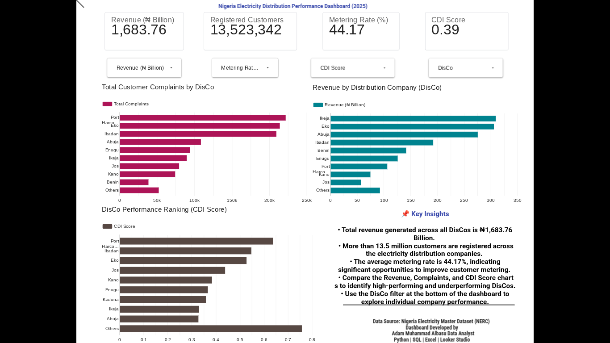

# ⚡ Nigeria Electricity Distribution Performance Dashboard (2025)



## 📌 Project Overview

This project analyzes the operational performance of Nigeria's Electricity Distribution Companies (DisCos) using interactive business intelligence dashboards. The analysis focuses on revenue generation, customer base, metering efficiency, billing performance, collection efficiency, customer complaints, and overall operational performance.

The dashboard was developed using **Looker Studio** with supporting analysis performed using **Python**, **SQL**, and **Google Colab**.

---

# 🎯 Business Problem

Nigeria's electricity distribution sector faces several operational challenges, including:

- Low metering rates
- Customer complaints
- Revenue collection inefficiencies
- Uneven DisCo performance

This dashboard provides a centralized view of these indicators to support data-driven decision-making.

---

# 🎯 Project Objectives

- Analyze revenue across Distribution Companies.
- Evaluate customer registration.
- Measure metering efficiency.
- Compare billing and collection efficiency.
- Monitor customer complaints.
- Rank DisCos using the CDI Score.
- Build an interactive executive dashboard.

---

# 📊 Dashboard Features

### KPI Cards

- Total Revenue
- Registered Customers
- Average Metering Rate
- Average CDI Score

### Interactive Visualizations

- Revenue by Distribution Company
- Customer Complaints by Distribution Company
- Distribution Company Performance Ranking
- Interactive DisCo Filter
- Executive Insights Panel

---

# 🛠 Tools Used

- Python
- Pandas
- Google Colab
- SQL
- Looker Studio
- GitHub
- Excel

---

# 📂 Project Structure

```text
Nigeria-Electricity-Analytix/
│
├── data/
│   ├── raw/
│   ├── cleaned/
│
├── python/
│   ├── data_cleaning.py
│   ├── exploratory_analysis.py
│   └── visualization.py
│
├── sql/
│   ├── database.sql
│   ├── cleaning.sql
│   └── analysis.sql
│
├── notebooks/
│   └── electricity_analysis.ipynb
│
├── dashboard/
│
├── images/
│
└── README.md
```

---

# 📈 Key Insights

- Over **13.5 million** customers are registered across Nigerian DisCos.
- Total revenue exceeds **₦1.68 trillion**.
- The average metering rate is **44.17%**, indicating significant room for improvement.
- Revenue and customer complaints vary considerably across DisCos.
- CDI Score highlights differences in operational performance among electricity distributors.

---

# 💡 Recommendations

- Accelerate smart meter deployment.
- Improve customer complaint resolution processes.
- Increase billing efficiency through digital billing systems.
- Strengthen revenue collection strategies.
- Use KPI monitoring for continuous operational improvement.

---

# 🚀 How to Run

1. Clone this repository

```bash
git clone https://github.com/albasu001/Nigeria-Electricity-Analytix.git
```

2. Install dependencies

```bash
pip install -r requirements.txt
```

3. Run Python scripts

```bash
python python/data_cleaning.py
python python/exploratory_analysis.py
python python/visualization.py
```

---

# 📸 Dashboard Preview

```
images/dashboard.png
```

---

# 🔮 Future Improvements

- Predict electricity demand using Machine Learning.
- Forecast DisCo revenue.
- Develop anomaly detection for operational performance.
- Integrate real-time electricity data.
- Deploy the dashboard as a web application.

---

# 👨‍💻 Author

**Adam Muhammad Albasu**

Data Analyst | Python | SQL | Excel | Looker Studio

GitHub:
https://github.com/albasu001

LinkedIn:
(www.linkedin.com/in/adam-muhammad-albasu-762a22386)

Email:
(muhammalbasu@gmail.com)

---

# 📄 License

This project is licensed under the MIT License.
